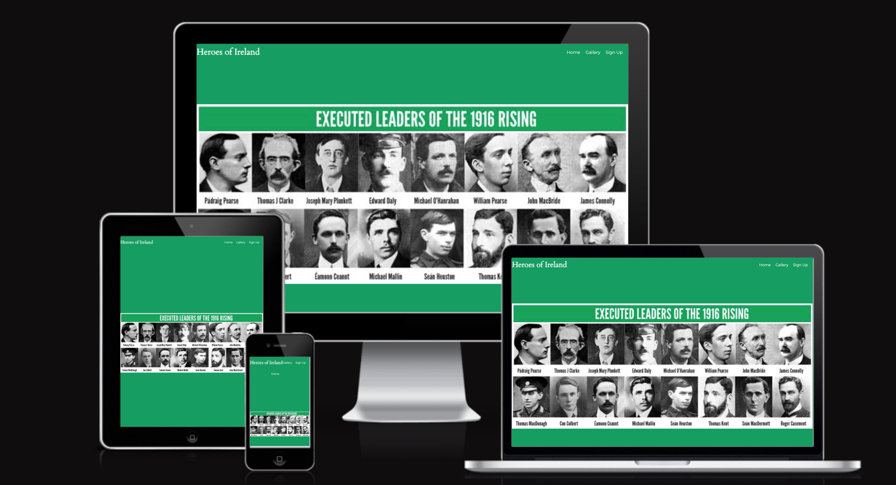
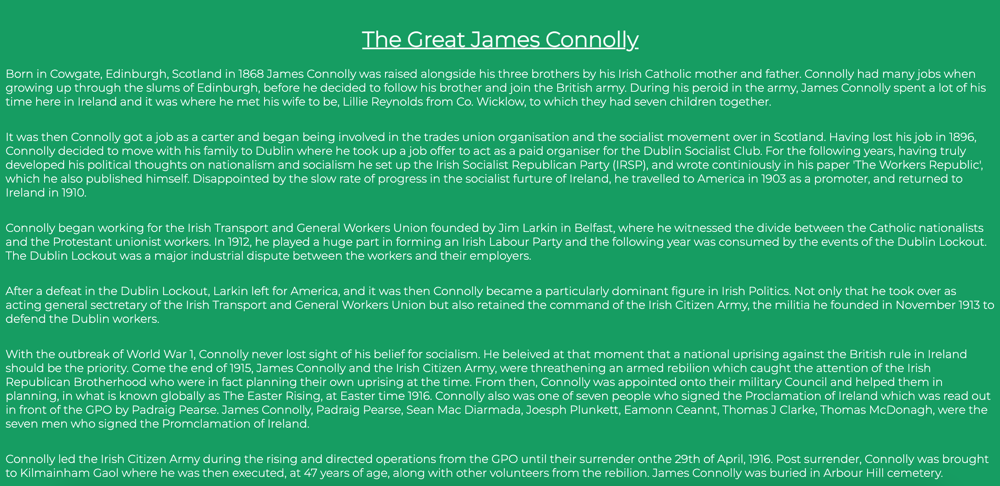
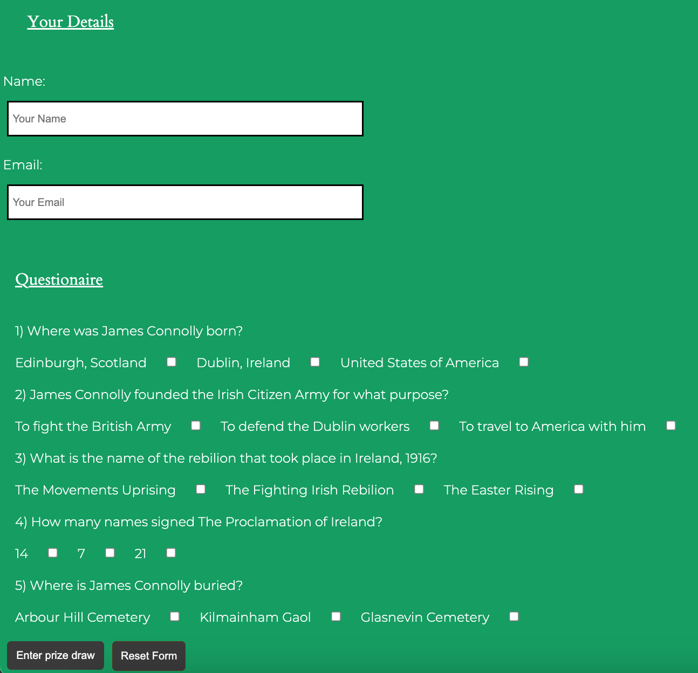
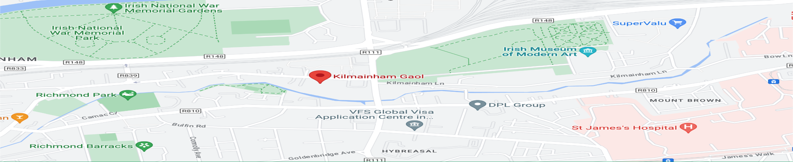
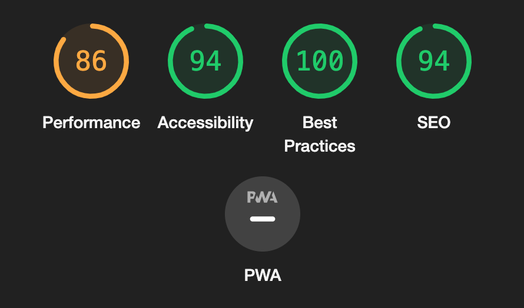
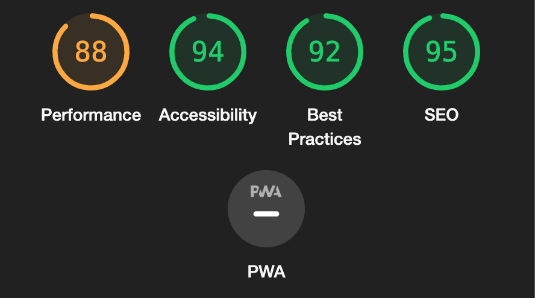
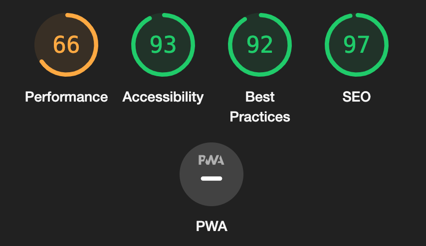

# Heroes of Ireland

Heroes of Ireland is a website that gives you historical facts surrounding Irish heroes, in particular this page, James Connolly. It will give you a timeline of his life up until his execution in 1916. There is a gallery section that will allow you to view some images and quotes from him. Finally, a quiz page that will allow you to enter a draw with a chance to win a trip to Kilmainham Gaol, where he along with other men was executed.

Please follow the link below to the webpage -

[Heroes of Ireland](https://8000-diarmaidmcdonald-project-yl9o4dg1k3.us2.codeanyapp.com/index.html)

## Users Experience

#### Project Goals

This website will give you a descriptive timeline of the life of James Connolly.
A gallery section.
Offer its readers a chance to win a trip to Kilmainham Gaol where they will further educate themselves on the events that took part there.

#### Typography

The main font used in the site is Montserrat, with Sans-Serif as a backup in case Montserrat fails.

## Features

#### Navigation through the website

As shown in the photo above 'Home', 'Gallery', and 'Sign Up' can be found on all three of the pages throughout the website. These are fully responsive and will navigate you to the page you require to view on all devices.

#### The Landing Page Image

The photo above shows past Irish heroes who were executed.

#### Paragraphs

This timeline depicts the life of James Connolly.

#### Video of Kilmainham Gaol

Once clicked to play, the video will present what is to offer should you win the draw.

#### Personal Details and Questionaire

Should you wish to partake in the draw you must enter your details (name and email address) and answer the following questions correctly by ticking the boxes provided before pressing the submit button.
If, for some reason, you wish to answer the questions again hit the reset button and you will be able to click on the answers again.

#### Map to Kilmainham Gaol

The map will show you where it is and what is around it. Should you need directions, click on the photo provided and Kilmainham Gaol will be marked on Google Maps.

#### Footer

The footer provides links to social media websites provided i.e, Facebook, Twitter, YouTube, and Instagram.
Once clicked upon, the links will open in a new tab.

#### Easter Egg

As this website is called Heroes of Ireland and the timeline provided is about James Connolly, the colours used for the background (green), writing (white), and footer (orange) relate to the Irish flag.

## Testing

#### Validator Testing

##### HTML

W3C Markup Validator found no errors on the web pages.

##### CSS

W3C CSS Validator found an error suggesting that the value 'center' assigned to float didn't work.

#### Accessibility

Lighthouse was used in the Chrome Developer Tools.

#### Lighthouse reports:

Landing Page:

Gallery Page:

Sign Up Page:

## Deployment

This site was deployed through GitHub pages.

In order to access the site you must:

1. Firstly, log in to GitHub.
2. Once logged in above the GitHub Repository section, click on the settings option.
3. Scroll down the page, and to your left you will see 'Pages'.
4. Having clicked on 'Pages' under Source, click the dropdown called None and select 'Main' or 'Master Branch'.
   5.The page will refresh automatically and generate a link to your website on top of the page.

## Credits

#### Media

YouTube channel, Connolly Cove, for the video on the 'signup page'.
RTE for assisting me with the timeline of James Connolly.

#### Mentor

My mentor Marcel for his time, guidance, and feedback.

#### Code Institute and Slack Community

For their support and for providing me with the necessary knowledge to complete this project.
